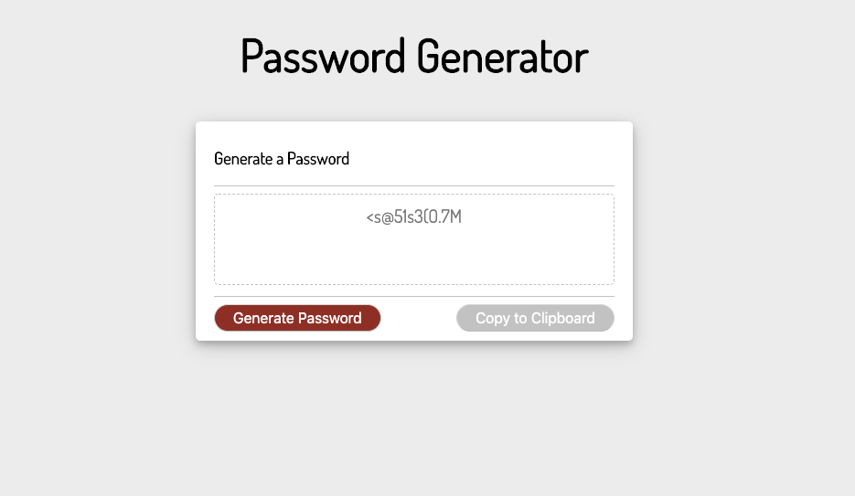

# Random-Password-Generator

## Front End:

The user will be prompted with questions about the password length and what characters to include or exclude from the password

Then they will press the "Generate Password" button.

A password will appear in the textarea to the users specifications

The user can then manually copy it from the textarea or click the "Copy to Clipboard" to automatically copy it to their clipboard, where they can paste it where ever they would like.

## Back End:

I started out defining 4 string variables for special characters, numbers, uppercase and lowercase letters.

From the data the user provides a set of if statements determines what will characters be included in the password.

### When the user clicks "Generate Password":

Using For loops, there will 2 rounds of randomization to create the password.

Based on what the length of the password is, each character type will go through the first wave of randomization, which will create a single long string.

Then there is a final round of randomization that randomly picks letters for the final password.

### When the user clicks "Copy to Clipboard":

The password within the textarea is selected, then copied, and pasted into the users clipboard

A alert will show confirming that the password was copied to clipboard correctly

### Image Below

